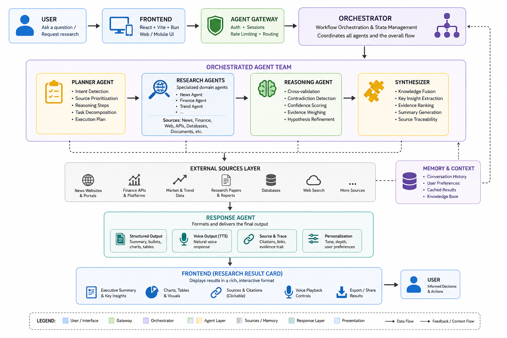
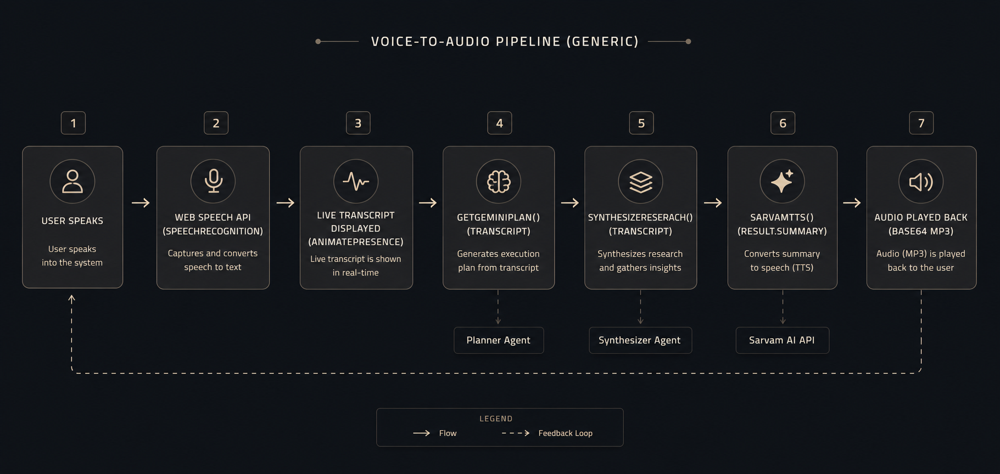

# Codex · Orchid Intelligence

> **The research engine for the agentic age.**  
> A calm, source-backed workspace designed for deep market discovery, multimodal analysis, and institutional-grade reasoning.

---

## Table of Contents

1. [Overview](#1-overview)
2. [Live Demo](#2-live-demo)
3. [Features](#3-features)
4. [Architecture](#4-architecture)
5. [Agent Pipeline](#5-agent-pipeline)
6. [Tech Stack](#6-tech-stack)
7. [Project Structure](#7-project-structure)
8. [Pages & Routes](#8-pages--routes)
9. [AI & Agent System](#9-ai--agent-system)
10. [Data Sources](#10-data-sources)
11. [Voice System](#11-voice-system)
12. [Authentication](#12-authentication)
13. [Design System](#13-design-system)
14. [Environment Variables](#14-environment-variables)
15. [Getting Started](#15-getting-started)
16. [Performance Targets](#16-performance-targets)

---

## 1. Overview

**Codex** (powered by **Orchid Intelligence**) is an AI-native, multilingual research platform built around agentic reasoning and dual-LLM orchestration.

The platform enables users to perform:

| Capability | Description |
|---|---|
| Market Research | Structured queries on sectors, industries, and trends |
| Financial Analysis | Stock comparisons, metrics, and historical data |
| News Intelligence | Real-time headline analysis and topic detection |
| Trend Discovery | Cross-signal trend synthesis from multiple sources |
| Conversational Exploration | Chat-first investigation with source attribution |
| Voice-Based Research | Spoken queries with audio responses via Sarvam AI |

The system separates **planning** (DeepSeek R1 via OpenRouter) from **communication** (Sarvam AI), enforcing tool-first, hallucination-free research.

---

## 2. Live Demo

Deployed on **Vercel** — SPA routing handled via `vercel.json` rewrites.

```
Routes:
  /             → About / Landing
  /auth         → Sign In / Sign Up
  /onboarding   → Profile Setup (post-signup)
  /research     → Main Research Interface
  /voice        → Voice Agent (Orchid)
  /account      → User Account & Settings
```

---

## 3. Features


### 🧠 Agentic Planning
Every investigation begins with a strategic plan. The Planner agent decomposes complex queries into executable steps before any data is collected.

### 🌐 Multilingual Research
Research meets users in 7 languages: **English, Hindi, Marathi, Tamil, Telugu, Bengali, Gujarati**. Language is set at onboarding and respected throughout the entire pipeline including voice synthesis.

### 🎙️ Voice-First Mode
The `/voice` route provides a dedicated, full-screen voice experience. Features:
- 3D animated orb (Spline scene)
- Live speech-to-text transcript
- Automatic query processing
- Sarvam AI TTS voice responses (speaker: `shubh`, model: `bulbul:v3`)
- Browser `SpeechRecognition` fallback

### 🛡️ Source-Grounded AI
Strict data provenance. No hallucinations. All research is grounded in:
- **Yahoo Finance** — market data & stock metrics
- **Moneycontrol** — Indian financial intelligence & fundamentals
- **GNews** — news headlines and digest

### 🔄 Circuit Breaker
A session-level circuit breaker (`circuitBreaker.js`) monitors API quota state. When daily limits are exhausted, it immediately falls back to a demo mode — no retries, no 60-second waits.

### 🌓 Dark / Light Mode
Full theme toggle, persisted via custom `useTheme` hook.

### 🎵 Ambient Audio
Optional looping background audio track (controlled via nav speaker toggle). Autoplay attempted on load; respects browser policies.

---

## 4. Architecture




### Core Architecture Principles

| Principle | Rule |
|---|---|
| **Planner / Executor Separation** | Planning model (DeepSeek R1) never speaks to users |
| **Tool-First Research** | APIs before LLM reasoning. LLMs never fabricate market data |
| **Explainable Outputs** | All results include sources, reasoning trace, and confidence score |
| **API Efficiency** | Circuit breaker prevents redundant calls on quota exhaustion |

---

## 5. Agent Pipeline


The 5-stage agent pipeline runs sequentially on every research query:

| Step | Agent | Action | Model/Tool |
|---|---|---|---|
| 1 | **Intent** | Classifies language, domain, and complexity | Derived from query |
| 2 | **Planner** | Builds a tool-first investigation path | DeepSeek R1 (OpenRouter) |
| 3 | **Research** | Collects market, news, and financial signals | Yahoo Finance · Moneycontrol · GNews |
| 4 | **Reasoning** | Separates evidence from inference | OpenRouter (auto) |
| 5 | **Response** | Shapes the answer for language and modality | Sarvam AI TTS / Text |

### Planner Output Schema
```json
{
  "intent": "market_analysis",
  "source_priority": "YFinance",
  "reasoning_steps": [
    "Activate signal retrieval",
    "Validate source provenance",
    "Synthesize brief"
  ]
}
```

### Synthesizer Output Schema
```json
{
  "summary": "2-sentence institutional thesis",
  "bullets": ["finding 1", "finding 2", "finding 3", "finding 4"],
  "confidence": 88,
  "sources": [
    { "title": "Yahoo Finance quote stream", "type": "Market data", "freshness": "live", "confidence": 88 }
  ],
  "trace": ["Retrieved sector signals", "Cross-validated", "Calibrated confidence"]
}
```

---

## 6. Tech Stack


### Frontend
| Technology | Version | Purpose |
|---|---|---|
| **React** | ^19.2.6 | UI framework |
| **Vite** | ^8.0.12 | Build tool & dev server |
| **Bun** | latest | Package manager & runtime |
| **React Router DOM** | ^7.17.0 | Client-side routing |
| **Framer Motion** | ^12.40.0 | Animations & page transitions |
| **React Icons** | ^5.6.0 | Icon library (Feather Icons) |
| **@splinetool/react-spline** | ^4.1.0 | 3D orb scene on Voice page |

### AI & APIs
| Technology | Purpose |
|---|---|
| **OpenRouter** (`openrouter/auto`) | AI gateway — routes to best available free model |
| **DeepSeek R1** | Reasoning model for Planner & Synthesizer (via OpenRouter) |
| **Sarvam AI** (`bulbul:v3`) | Multilingual TTS, speaker `shubh` |
| **GNews API** | News headlines and market digest |

### Auth & Infrastructure
| Technology | Purpose |
|---|---|
| **Firebase Auth** | Email/password authentication |
| **localStorage** | Profile persistence per user UID |
| **Vercel** | Deployment with SPA rewrite rules |

---

## 7. Project Structure

```
codexcomm/
├── public/
│   ├── logo.png                # Brand logo
│   ├── diagram.png             # Agent diagram (used on About page)
│   ├── vec.jpg                 # Hero visual
│   ├── voice.splinecode        # 3D Spline scene for Voice page
│   ├── backg.mp3               # Ambient background audio
│   ├── favicon.ico / .svg      # Favicons
│   ├── readme-architecture.png # README: system architecture
│   ├── readme-features.png     # README: feature showcase
│   ├── readme-agents.png       # README: agent pipeline
│   └── readme-techstack.png    # README: tech stack
│
├── src/
│   ├── agents/
│   │   ├── planner.js          # Planner agent — DeepSeek R1 via OpenRouter
│   │   ├── synthesizer.js      # Synthesizer agent — structured research brief
│   │   └── circuitBreaker.js   # API quota state & fallback manager
│   │
│   ├── components/
│   │   ├── auth/
│   │   │   └── AuthProvider.jsx       # Firebase auth context provider
│   │   ├── layout/
│   │   │   ├── TopNav.jsx             # Primary navigation bar
│   │   │   └── ProtectedRoute.jsx     # Auth-gated route wrapper
│   │   ├── research/
│   │   │   ├── AgentRail.jsx          # 5-step agent progress rail
│   │   │   ├── NewResearch.jsx        # Research start screen with source selector
│   │   │   ├── ResearchChips.jsx      # Quick-pick query chips
│   │   │   ├── ResearchHero.jsx       # Research page header & language toggle
│   │   │   ├── ResearchInput.jsx      # Query text input
│   │   │   ├── ResearchMap.jsx        # (Reserved)
│   │   │   └── ResearchResult.jsx     # Result card: summary, bullets, sources, trace
│   │   └── ui/
│   │       └── FeaturePanel.jsx       # Reusable feature card panel
│   │
│   ├── config/
│   │   └── firebase.js         # Firebase app & auth initialization
│   │
│   ├── contexts/
│   │   └── authContext.js      # React context for auth state
│   │
│   ├── data/
│   │   └── research.js         # Static data: sample prompts, agent steps, sources, languages
│   │
│   ├── hooks/
│   │   ├── useAuth.js          # useContext wrapper for auth
│   │   └── useTheme.js         # Theme toggle hook with localStorage persistence
│   │
│   ├── pages/
│   │   ├── AboutPage.jsx       # Landing page with bento grid
│   │   ├── AuthPage.jsx        # Sign in / Sign up form
│   │   ├── OnboardingPage.jsx  # Post-signup profile setup
│   │   ├── ResearchPage.jsx    # Main research experience
│   │   ├── VoicePage.jsx       # Voice-first research with Spline orb
│   │   ├── AccountPage.jsx     # User account & theme settings
│   │   ├── ProfilePage.jsx     # (Redirect to account)
│   │   └── SettingsPage.jsx    # (Redirect to account)
│   │
│   ├── App.jsx                 # Root router with AnimatePresence transitions
│   ├── App.css                 # Global styles, design system, all component styles
│   ├── index.css               # Base resets & CSS custom properties
│   └── main.jsx                # React entry point
│
├── index.html                  # HTML shell with meta tags & font imports
├── vite.config.js              # Vite configuration
├── eslint.config.js            # ESLint configuration
├── vercel.json                 # Vercel SPA rewrite rules
├── package.json                # Dependencies & scripts
├── PRD.md                      # Product Requirements Document
├── MAS.md                      # Master Architecture Specification
└── .env                        # Environment variables (not committed)
```

---

## 8. Pages & Routes

### `/` — About Page (Landing)
- Hero section with animated search launcher
- Bento grid showcasing: Agentic Planning, Multimodal Architecture, Source Grounding, Minimal Design
- Click-to-fill example prompts routed to `/research`
- Footer

### `/auth` — Authentication
- Toggle between **Sign In** and **Sign Up** modes
- Firebase Email/Password auth
- Redirects to `/onboarding` on new signup
- Redirects to `/research` on existing sign in

### `/onboarding` — Profile Setup *(protected)*
- Collects: Full name, Email, Mobile, Role (Founder / Investor / Analyst / Student), Language preference
- Profile persisted in `localStorage` keyed by Firebase UID
- Redirects to `/research` on completion

### `/research` — Research Interface *(protected)*
- **New Research screen**: time-based greeting, source selector (All / YFinance / Moneycontrol), large textarea
- **Active Research**: Agent Rail progress, running indicator, error banner
- **Result card**: Intent, summary, key findings, confidence score, source citations, reasoning trace
- Quick-pick chips for common queries
- Language toggle for multilingual output

### `/voice` — Voice Agent (Orchid) *(protected)*
- Full-screen 3D Spline orb (lazy-loaded)
- Personalized audio greeting on page load via Sarvam TTS
- Mic button: tap to listen, tap again to process
- Live transcript overlay
- Voice state labels: Idle → Listening → Analyzing → Speaking
- Fallback to browser `SpeechSynthesis` if Sarvam API fails

### `/account` — Account & Settings *(protected)*
- User profile display
- Theme toggle (light/dark)

---

## 9. AI & Agent System

### Planner Agent (`src/agents/planner.js`)

Calls **OpenRouter** with the `openrouter/auto` model selector (DeepSeek R1 on free tier). Outputs a structured JSON plan:

```js
// Input: user query string
// Output:
{
  intent: "market_analysis | stock_comparison | trend_discovery | ...",
  source_priority: "YFinance" | "Moneycontrol",
  reasoning_steps: ["step 1", "step 2", "step 3"]
}
```

Strips DeepSeek R1 `<think>…</think>` reasoning tags before JSON parsing. Falls back to `{ intent: "general_research", source_priority: "Moneycontrol" }` on failure.

---

### Synthesizer Agent (`src/agents/synthesizer.js`)

Produces institutional-grade research briefs. Uses `openrouter/auto` with temperature `0.4`. Outputs:

```js
{
  summary: "2-sentence institutional thesis",
  bullets: ["finding 1", "finding 2", "finding 3", "finding 4"],
  confidence: 88,          // integer 70–96
  sources: [...],          // title, type, freshness, confidence
  trace: [...]             // reasoning steps
}
```

Includes topic-aware demo fallbacks for gold, AI/tech, and general queries when the API is unavailable.

---

### Circuit Breaker (`src/agents/circuitBreaker.js`)

Session-level API quota manager:

| Method | Behaviour |
|---|---|
| `circuitBreaker.isOpen()` | Returns `true` if daily quota is exhausted |
| `circuitBreaker.classify(error)` | Returns `'daily' \| 'minute' \| null` |
| `circuitBreaker.record(error)` | Opens circuit permanently for daily limits; returns retry delay for per-minute limits |
| `circuitBreaker.status()` | Human-readable status string |

Daily quota exhaustion triggers a permanent open for the browser session, auto-resetting at ~07:00 UTC (midnight PT).

---

### Orchestration Rules

| Rule | Detail |
|---|---|
| No LLM hallucination | LLMs never fabricate market data — all signals come from APIs first |
| Planner never speaks | DeepSeek R1 only generates plans, never user-facing text |
| All outputs are sourced | Every research result includes source citations |
| Tool-first hierarchy | APIs → Internal Context → Cached Results → LLM Reasoning |

---

## 10. Data Sources

| Source | Type | Data |
|---|---|---|
| **Yahoo Finance** | Market Data | Stock quotes, historical trends, financial metrics |
| **Moneycontrol** | Financials | Indian market fundamentals, company data |
| **GNews API** | News | Market headlines, topic detection, news digest |

> ⚠️ Web scraping is strictly prohibited. Only structured API integrations are permitted.

---

## 11. Voice System



**TTS Configuration:**
```json
{
  "speaker": "shubh",
  "model": "bulbul:v3",
  "speech_sample_rate": 16000,
  "enable_preprocessing": true,
  "audio_format": "mp3"
}
```

Language is determined by `profile.language`:
- English → `en-IN`
- Hindi → `hi-IN`
- Other → `en-IN`

---

## 12. Authentication

Firebase Email/Password auth with a lightweight profile layer:

```
Sign Up
  → Firebase createUserWithEmailAndPassword
  → updateProfile (displayName)
  → Redirect to /onboarding

Onboarding
  → Collect: name, email, mobile, role, language
  → Save to localStorage: key = `orchide-profile-{uid}`
  → Redirect to /research

Sign In
  → Firebase signInWithEmailAndPassword
  → onAuthStateChanged rehydrates profile from localStorage
  → Redirect to /research (or intended route)
```

**`isOnboarded`** = `Boolean(profile?.name && profile?.mobile)` — used by `ProtectedRoute` to gate `/research`, `/voice`, `/account`.

---

## 13. Design System

### Color Palette

| Token | Hex | Usage |
|---|---|---|
| **Crail** | `#C15F3C` | Primary accent, CTAs, active states |
| **Pampas** | `#F4F3EE` | Light mode background |
| **Cloudy** | `#B1ADA1` | Muted text, borders |
| **White** | `#FFFFFF` | Cards, surfaces |
| **Dark** | `#0d0d0d` | Dark mode background |

### Typography

| Role | Font |
|---|---|
| Primary | Inter |
| Secondary | Poppins |
| Editorial | Garamond |

### Design Inspiration
- **Claude** — minimal conversational interface
- **Linear** — clean, focused product design
- **Webflow** — elegant typography and spacing
- **Perplexity** — source-attributed AI research UI

### Motion
- **Framer Motion** — page transitions with `AnimatePresence mode="wait"`
- Research results fade-in with `y: 24 → 0` easing
- Voice state labels animate per state change

---

## 14. Environment Variables

Create a `.env` file at the project root:

```env
# OpenRouter (Planner & Synthesizer — DeepSeek R1 free tier)
VITE_OPENROUTER_API_KEY=your_openrouter_key

# Sarvam AI (TTS — Voice page)
VITE_SARVAM_API_KEY=your_sarvam_key

# Firebase Authentication
VITE_FIREBASE_API_KEY=your_firebase_api_key
VITE_FIREBASE_AUTH_DOMAIN=your_project.firebaseapp.com
VITE_FIREBASE_PROJECT_ID=your_project_id
VITE_FIREBASE_STORAGE_BUCKET=your_project.appspot.com
VITE_FIREBASE_MESSAGING_SENDER_ID=your_sender_id
VITE_FIREBASE_APP_ID=your_app_id
VITE_FIREBASE_MEASUREMENT_ID=G-XXXXXXXXXX

# News (GNews API)
VITE_GNEWS_API_KEY=your_gnews_key
```

> 🔒 Never commit `.env` to version control. All keys are `VITE_` prefixed for Vite client exposure. In production, set these as Vercel environment variables.

---

## 15. Getting Started

### Prerequisites
- [Bun](https://bun.sh/) (recommended) or Node.js 18+
- Firebase project with Email/Password auth enabled
- OpenRouter account (free tier available)
- Sarvam AI account

### Installation

```bash
# Clone the repository
git clone <repo-url>
cd codexcomm

# Install dependencies
bun install
# or: npm install

# Set up environment variables
cp .env.example .env
# Edit .env with your API keys

# Start development server
bun run dev
# or: npm run dev
```

The app will be available at `http://localhost:5173`

### Build for Production

```bash
bun run build
# or: npm run build
```

### Deploy to Vercel

The `vercel.json` is already configured for SPA routing:

```json
{
  "rewrites": [{ "source": "/(.*)", "destination": "/index.html" }]
}
```

Push to your repository and connect to Vercel. Set all `VITE_` environment variables in the Vercel dashboard.

---

## 16. Performance Targets

| Metric | Target |
|---|---|
| Initial render | < 2 seconds |
| Interaction latency | < 500ms |
| Research completion | < 5 seconds |
| Source attribution coverage | 90% |
| LLM routing accuracy | 95% |
| Redundant LLM calls saved | 50%+ |
| Uptime | 99.9% |

---

*Built for the agentic future.*
